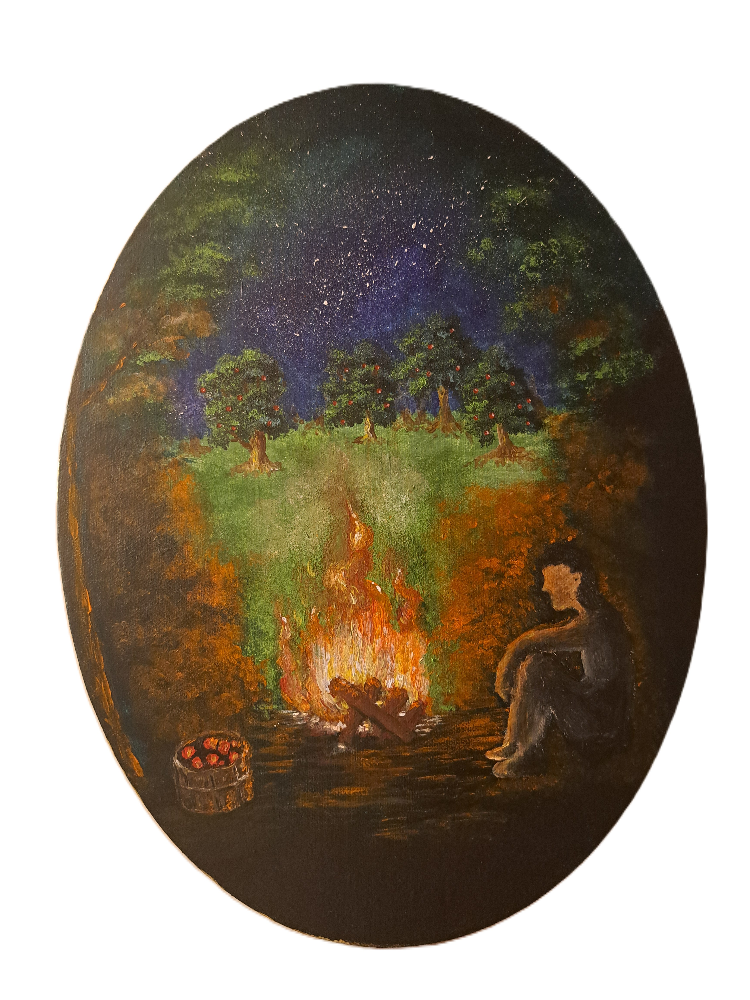

<table>
  <tr>
    <td>
      
    </td>
    <td>

# 📘Nuo Aibių iki Struktūrų
Ši knyga, skirta smalsiems moksleiviams, kviečia pažvelgti į matematiką kaip į procesą, kuriame pavieniai objektai palaipsniui įgauna prasmę per savo tarpusavio ryšius, o šie ryšiai virsta struktūromis. Kelionė prasideda nuo aibių, tęsiasi per sąryšius, atvaizdavimus ir veda į vientisą matematinės kalbos vaizdą.

---

## ⬇️ [Atsisiųsti](https://raw.githubusercontent.com/Philscie/nuo-aibiu-iki-strukturu/main/Borodinas_nuo-aibiu-iki-strukturu-2026.pdf)
